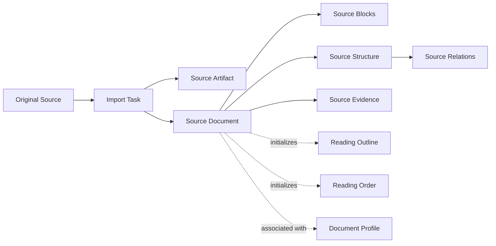
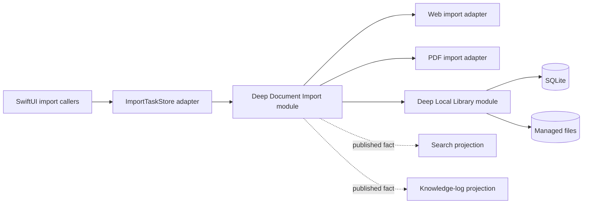
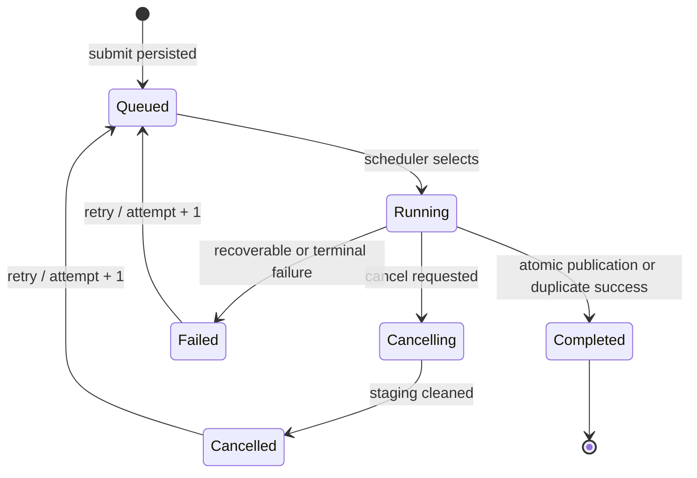
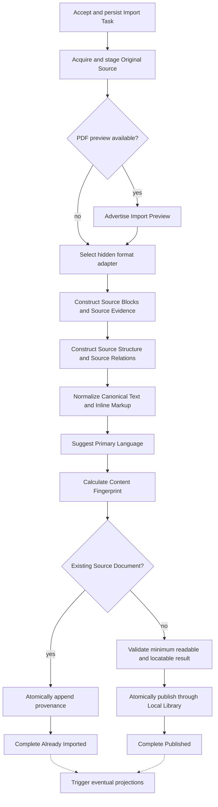

# Document Import Architecture Design

> Status: approved design, pending user review  
> Date: 2026-08-05  
> Product scope: macOS V1, one developer, six-month target  
> Related documents: [macOS V1 scope](../../product/macos-v1-scope.md), [domain language](../../../CONTEXT.md)

## 1. Purpose

The Document Import module turns an external webpage URL or PDF file into a durable Source Document in the local library.

Its interface expresses one user intent—import this Original Source—while its implementation hides acquisition, parsing, normalization, queueing, recovery, deduplication, validation, and atomic publication.

The module is designed to be deep:

- callers learn one small task-oriented interface;
- Web and PDF format knowledge remains behind the seam;
- workflow ordering and recovery have strong locality;
- the same interface is the test surface.

## 2. Scope

### 2.1 Included

- Public webpage URL import.
- Local PDF import.
- Static webpage acquisition with an isolated dynamic-rendering fallback.
- Managed Source Artifact creation.
- Source Block, Source Structure, Source Relation, and Source Evidence construction.
- Canonical Text and limited Inline Markup normalization.
- Document-level Primary Language suggestion.
- Content Fingerprint calculation and deterministic duplicate detection.
- Recoverable, cancellable, durable Import Tasks.
- A single-heavy-task queue.
- Read-only PDF Import Preview.
- Import Issues for localized degradation.
- Atomic Source Document publication through the neighboring Local Library module.
- Privacy-preserving diagnostics.

### 2.2 Excluded

- OCR for scanned PDFs.
- Password-protected PDFs.
- EPUB, DOCX, Markdown, browser-extension, or pasted-text import.
- Cloud AI participation in authoritative Source Document construction.
- Automatic reprocessing of existing Source Documents after parser changes.
- Source Block Canonical Text editing.
- Reading-view ownership, persistent annotations, translation, search indexing, and knowledge-log projection.
- Generic third-party import plugins or a public format registry.

## 3. Domain model

The canonical definitions live in [CONTEXT.md](../../../CONTEXT.md). The relationships relevant to this module are:



### 3.1 Source Document composition

A published Source Document contains:

- one immutable Source Artifact;
- stable Source Blocks;
- immutable Source Structure;
- Source Evidence for every locatable Source Block;
- imported metadata and a Primary Language suggestion;
- Content Fingerprint;
- zero or more Import Issues;
- the import-rule version that produced it.

The Source Artifact is the visual authority. Canonical Text is the normalized text authority used by quotation, search, translation, and export.

### 3.2 Source Block categories

Source Blocks use three principal categories:

- Text Block: heading, paragraph, list item, quotation, caption, footnote, or reference entry.
- Code Block: code, command, or preformatted content preserved rather than translated as prose.
- Media Block: figure, table, or standalone formula whose original visual form is preserved.

Captions remain independent Text Blocks. Source Relations connect them to their Media Blocks.

An identical sentence in two source positions produces two distinct Source Blocks. Source Block identity represents an occurrence and location; content hashes are verification data, not identity.

### 3.3 Immutable source and editable overlays

The following remain immutable after publication:

- Source Artifact;
- Source Blocks and Canonical Text;
- Source Evidence;
- Source Structure;
- imported metadata and Import Issues.

The following are editable outside Document Import:

- Document Profile;
- Reading Outline;
- Reading Order;
- translations and user notes.

User corrections therefore never rewrite the authority used by existing quotations and source positions.

## 4. Module placement



The external seam sits at:

> submit an Original Source, observe and control its Import Task, receive a final result.

SwiftUI Observation stays in an application adapter. It does not cross the Document Import seam.

## 5. Approved external interface

The following Swift is architectural pseudocode. Names and semantics are approved; implementation details may be refined without widening the interface.

### 5.1 Original Source

```swift
public enum OriginalSource: Hashable, Sendable {
    case webpage(URL)
    case pdfFile(URL)
}
```

This is intentionally closed for V1. Adding a third confirmed source type justifies revisiting it; hypothetical future formats do not justify a public registry today.

### 5.2 Document Import module

```swift
public actor DocumentImport {
    /// Returns only after the Import Task has been durably accepted.
    public func submit(
        _ source: OriginalSource
    ) async throws -> ImportTaskHandle

    /// The first emission is the complete current matching set.
    /// Later emissions replace that set with newer authoritative snapshots.
    public func observeTasks(
        _ query: ImportTaskQuery = .unfinished
    ) -> AsyncStream<[ImportTaskSnapshot]>
}
```

```swift
public enum ImportTaskQuery: Hashable, Sendable {
    case unfinished
    case active
    case all
}
```

Query meanings are fixed:

- `active` includes queued, running, and cancelling tasks;
- `unfinished` includes active tasks plus failed or cancelled tasks that remain available for retry or dismissal;
- `all` includes retained completed history as well.

`submit` throws only when the task cannot be safely accepted and persisted. Once a handle is returned, network, parsing, validation, and publication failures appear in task state instead of escaping through a detached error channel.

### 5.3 Import Task handle

```swift
public struct ImportTaskHandle: Sendable {
    public let id: ImportTaskID

    /// The first emission is the current authoritative snapshot.
    public func updates()
        -> AsyncStream<ImportTaskSnapshot>

    /// Waits for the current attempt to reach a terminal state.
    public func value()
        async -> ImportTerminalState

    /// Durable and idempotent until publication commits.
    public func cancel()
        async throws

    /// Reuses the Import Task identity, increments attempt,
    /// and resumes from the last valid checkpoint.
    public func retry()
        async throws

    /// Available only while a PDF preview is advertised.
    public func acquirePreview()
        async throws -> ImportPreviewLease
}
```

The handle is a capability tied to one Import Task. It does not expose parser choice, checkpoints, the task journal, or Local Library operations.

### 5.4 Task snapshots

```swift
public struct ImportTaskSnapshot: Sendable {
    public let id: ImportTaskID
    public let revision: UInt64
    public let attempt: Int
    public let source: OriginalSourceSummary
    public let state: ImportTaskState
    public let preview: ImportPreviewAvailability
}
```

```swift
public enum ImportTaskState: Sendable {
    case queued(position: Int)
    case running(ImportProgress)
    case cancelling
    case failed(ImportFailure)
    case cancelled
    case completed(ImportSuccess)
}
```

```swift
public struct ImportProgress: Sendable {
    public let activity: ImportActivity
    public let completedUnitCount: Int64
    public let totalUnitCount: Int64?
}

public enum ImportActivity: Sendable {
    case acquiringOriginalSource
    case constructingSourceDocument
    case publishing
}
```

Import Activity is descriptive. Callers must never use it to drive workflow ordering.

`revision` increases monotonically within an Import Task. A retry keeps the task ID, increments `attempt`, and produces a new sequence of revisions.

### 5.5 Success and terminal state

```swift
public enum ImportSuccess: Sendable {
    case published(
        documentID: SourceDocumentID,
        issues: [ImportIssue]
    )

    case alreadyImported(
        documentID: SourceDocumentID,
        location: ExistingDocumentLocation,
        provenanceAdded: Bool
    )
}

public enum ExistingDocumentLocation: Sendable {
    case library
    case trash
}
```

```swift
public enum ImportTerminalState: Sendable {
    case success(ImportSuccess)
    case failure(ImportFailure)
    case cancelled
}
```

Already Imported is a success:

- no duplicate Source Document is created;
- the new Original Source is appended as provenance when possible;
- an existing document in the library can open immediately;
- an existing document in trash prompts the user to restore it through Local Library.

### 5.6 Submission and task failures

Submission errors are limited to failures that prevent creation of a durable Import Task:

```swift
public enum ImportSubmissionError: Error, Sendable {
    case invalidWebURL
    case unreadablePDFSelection
    case insufficientDiskSpace
    case localLibraryUnavailable
    case cannotPersistImportTask
}
```

Task failures are durable, observable data:

```swift
public struct ImportFailure: Error, Sendable {
    public let code: Code
    public let recovery: Recovery
    public let diagnosticID: UUID

    public enum Recovery: Sendable {
        case retryable
        case requiresNewOriginalSource
        case requiresUserAction
        case unsupported
    }

    public enum Code: Sendable {
        case networkUnavailable
        case requestTimedOut
        case websiteAccessDenied
        case webpageHasNoReadableArticle
        case sourceAccessLost
        case passwordProtectedPDF
        case restrictedPDF
        case corruptSource
        case noReadableContent
        case noLocatableSourceBlocks
        case insufficientDiskSpace
        case localLibraryUnavailable
        case internalInvariantViolation
    }
}
```

Import Failure must not contain Canonical Text, full local paths, URL query parameters, cookies, or credentials.

### 5.7 Import Preview

```swift
public enum ImportPreviewAvailability: Sendable {
    case unavailable
    case preparing
    case available
}
```

```swift
public final class ImportPreviewLease: @unchecked Sendable {
    public enum Content: Sendable {
        case pdf(readOnlyFileURL: URL)
    }

    public let content: Content
}
```

The lease keeps staged preview content alive. Its rules are:

- it is temporary and cannot be persisted by callers;
- it permits read-only PDF navigation, zoom, search, and ordinary copy;
- it cannot create durable annotations, translations, notes, or source positions;
- after publication, the Reading module must open the Source Document rather than continue using the preview;
- cancellation asks the Reading adapter to close its preview and the task remains `cancelling` until outstanding preview leases are released;
- Document Import never creates or owns `PDFView`.

## 6. Common caller flows

### 6.1 Import and wait

```swift
let task = try await documentImport.submit(.webpage(url))

switch await task.value() {
case .success(.published(let documentID, _)):
    open(documentID)

case .success(.alreadyImported(let documentID, .library, _)):
    open(documentID)

case .success(.alreadyImported(let documentID, .trash, _)):
    offerRestore(documentID)

case .failure(let failure):
    show(failure)

case .cancelled:
    break
}
```

### 6.2 Task center

```swift
for await snapshots in documentImport.observeTasks(.unfinished) {
    importTaskStore.replace(with: snapshots)
}
```

`ImportTaskStore` is a `@MainActor @Observable` application adapter. It converts actor streams into SwiftUI state without making the core module depend on SwiftUI.

### 6.3 PDF preview

```swift
let task = try await documentImport.submit(.pdfFile(fileURL))

for await snapshot in task.updates() {
    guard snapshot.preview == .available else { continue }

    let lease = try await task.acquirePreview()
    readingWorkspace.openReadOnlyPreview(lease)
    break
}
```

## 7. Import Task lifecycle



### 7.1 Lifecycle invariants

- `submit` returning means the Import Task is durable.
- A selected PDF no longer needs to remain at its external path after `submit` returns because it has been copied into staging.
- Only one heavy Import Task runs at a time; accepted tasks use durable FIFO ordering.
- The module resumes queued and interrupted tasks from their latest safe checkpoint after application restart.
- Observation streams always begin with current authoritative state.
- Dropping an observation stream never cancels a task.
- Cancel is idempotent until publication commits.
- Cancel removes nonessential staged output. The durable Original Source request remains, so a later retry reacquires any source data whose checkpoint was cleaned.
- A task with an outstanding Import Preview lease may remain `cancelling` until the lease is released and staged files can be removed safely.
- An Import Task publishes at most one Source Document.
- Import Issues never represent whole-task failure.
- Search and knowledge-log projection failure never changes Import Success.

## 8. Hidden workflow

The implementation owns the following stages. They are observable only as coarse Import Activity and are not callable interface operations.



### 8.1 Publication minimum

A new Source Document may publish only when:

- the Source Artifact is safely staged;
- document identity and Content Fingerprint are known;
- stable Source Blocks and inferred reading order exist;
- every required Source Block has usable Source Evidence;
- minimum imported metadata is stored;
- validation confirms the document is readable and locatable.

Source Structure uncertainty, missing optional images, or weak media association may publish as Import Issues. Completely unreadable content or absence of locatable Source Blocks is Import Failure.

## 9. Format-specific implementation

### 9.1 Web adapter

The Web adapter owns:

- public URL acquisition;
- redirect and timeout handling;
- static content extraction;
- isolated, non-persistent WKWebView fallback when static content is insufficient;
- title, author, date, headings, text, code, links, citations, and media detection;
- webpage image localization;
- script, form, tracker, advertisement, and navigation removal;
- static local HTML package creation;
- Web Source Evidence construction.

Remote scripts may run only inside the isolated acquisition view. The final Source Artifact never retains or executes source scripts.

Failure to download one nonessential webpage image records an Import Issue. It does not change the webpage identity or fail an otherwise readable import.

### 9.2 PDF adapter

The PDF adapter owns:

- PDF staging and integrity checks;
- password/restriction detection;
- PDFKit text, page, bookmark, and geometry extraction;
- Text Block, Code Block, and Media Block recognition;
- single- and double-column reading-order inference;
- caption-to-media Source Relations;
- page- and region-based Source Evidence;
- Primary Language suggestion;
- Import Issues for uncertain order, hierarchy, decoding, or media association.

PDF media is identified during import, but page-region crops are generated lazily when translation or region capture needs them.

Password-protected PDFs fail with a typed unsupported result. V1 does not request or store passwords.

## 10. Content Fingerprint and duplicate handling

### 10.1 PDF

V1 uses a deterministic hash of the managed PDF bytes. Filename and original path are excluded.

### 10.2 Webpage

The principal fingerprint uses:

- Canonical Text;
- Source Block category and role;
- stable Source Block order.

Successfully downloaded article-image hashes may contribute supporting evidence, but a missing image cannot change the principal identity. URL, tracking parameters, advertisement content, recommendations, and capture time are excluded.

### 10.3 Duplicate transaction

Local Library must decide duplicate publication and provenance attachment atomically:

- no second Source Document is created;
- the new Original Source is attached when it adds provenance;
- the result reports whether the document is in the library or trash;
- a provenance-write failure does not falsely report `provenanceAdded: true`.

## 11. Dependency strategy

### 11.1 True external: webpage network

Document Import owns a private network port with at least two adapters:

- production adapter using URLSession and isolated WKWebView fallback;
- deterministic test adapter or local HTTP fixture adapter.

The port remains internal. Network request types do not cross the external seam.

### 11.2 Local-substitutable: Local Library

Document Import calls the neighboring Local Library module for:

- durable Import Task records and checkpoints;
- staging ownership;
- duplicate resolution;
- provenance attachment;
- atomic Source Document publication.

Tests use the real Local Library implementation backed by temporary SQLite and a temporary managed-files directory. A stack of repository mocks would test past the seam and is rejected.

### 11.3 Local-substitutable: PDF parsing and local files

Internal seams permit:

- production PDFKit parsing;
- deterministic fixture and fault adapters;
- production managed files;
- temporary test directories.

Golden-path tests still run PDFKit against fixed PDF fixtures so that focused fault adapters do not become the only evidence of correctness.

### 11.4 In-process

The following remain ordinary internal implementation without adapters:

- Canonical Text normalization;
- Inline Markup normalization;
- Source Block construction;
- Source Structure validation;
- Content Fingerprint composition;
- Import Issue classification.

These have one implementation and do not justify hypothetical seams.

## 12. Projection behavior

After successful publication, Document Import emits a durable publication fact. Search and knowledge-log modules eventually consume it.

Projection rules:

- Source Document success is not rolled back by projection failure.
- Failed projections remain retryable.
- Search and log structures are rebuildable from authoritative records.
- Document Import does not know FTS tables or knowledge-log schemas.

## 13. Privacy and security

- Canonical Text, user notes, cookies, credentials, and API keys never enter ordinary diagnostics.
- Logged URLs omit query and fragment; domain may be retained.
- Local paths are reduced to a filename or redacted form.
- Diagnostics contain task/document IDs, stage, duration, page and block counts, error codes, and a diagnostic ID.
- Web acquisition uses non-persistent website storage and never imports Safari authentication state.
- Source scripts cannot access the local library or Keychain.
- Final local HTML is static and script-free.
- Diagnostic-package export must enumerate included data before user confirmation.

## 14. Performance requirements

Measured on an Apple Silicon M1 Mac with 8 GB memory:

- a typical public webpage publishes within 10 seconds, excluding clearly reported network waiting;
- a normal 50-page text PDF publishes within 5 seconds;
- a large PDF offers Import Preview within 2 seconds;
- import work never blocks main-window scrolling or input;
- a single Import Task targets a memory peak below approximately 500 MB;
- block and media processing is streamed or batched rather than duplicated as whole-document memory graphs;
- stage timing identifies acquisition, construction, validation, and publication bottlenecks.

The 200 MB and 1,000-page figures are performance baselines, not hard product limits. Larger PDFs receive a warning and remain importable when disk and system resources permit.

## 15. Test strategy

The external Document Import interface is the primary test surface.

### 15.1 Fixture classes

Web fixtures include:

- ordinary static article;
- dynamically rendered article;
- redirects;
- missing image;
- timeout and network interruption;
- article with headings, code, links, citations, and media;
- duplicate content from a different URL.

PDF fixtures include:

- single-column text PDF;
- double-column academic PDF;
- headings and bookmarks;
- figures, tables, formulas, and captions;
- repeated identical text in different positions;
- uncertain reading order;
- missing or malformed text extraction;
- password-protected, restricted, and corrupt PDFs;
- representative 50-page and large documents.

### 15.2 Interface-level scenarios

Tests submit an Original Source, observe snapshots, and assert observable results:

- durable acceptance before `submit` returns;
- FIFO queue behavior and one-heavy-task limit;
- restart from every safe checkpoint;
- cancel before and during construction;
- cancellation too late after publication;
- retry with the same task ID and incremented attempt;
- successful publication with Import Issues;
- Already Imported in library and trash;
- atomic provenance attachment;
- preview availability and lease cleanup;
- projection failure after publication;
- disk exhaustion and Local Library unavailability;
- privacy-safe failure output.

Tests do not call parser stages directly or inspect private task-journal tables.

### 15.3 Network isolation

Automated tests never depend on public websites. A local HTTP server or deterministic adapter simulates responses. Public webpages are reserved for manual acceptance tests.

### 15.4 Golden results

Golden fixture expectations cover:

- Source Block categories, roles, identities, and order;
- Canonical Text and Inline Markup;
- Source Evidence presence;
- Source Structure and Source Relations;
- Content Fingerprint stability;
- Import Issue classification.

## 16. Proposed source layout

No files are scaffolded by this design. The expected implementation shape is:

```text
Sources/
├── KnowledgeCore/
│   ├── Documents/
│   └── DocumentImport/
│       ├── DocumentImport.swift
│       ├── ImportTask.swift
│       ├── ImportOutcome.swift
│       ├── ImportPreview.swift
│       └── Internal/
│           ├── ImportScheduler.swift
│           ├── ImportRecovery.swift
│           ├── SourceDocumentBuilder.swift
│           ├── WebImportAdapter.swift
│           └── PDFImportAdapter.swift
├── Infrastructure/
│   ├── LocalLibrary/
│   └── Diagnostics/
└── App/
    └── ImportTaskStore.swift

Tests/
├── DocumentImportTests/
├── Fixtures/Web/
└── Fixtures/PDF/
```

Internal file names may change. The architectural requirement is that format, workflow, recovery, and validation knowledge remain local to the Document Import implementation.

## 17. Rejected alternatives

### 17.1 Public generic format registry

Rejected for V1 because only Web and PDF are confirmed. Generic `ImportFormat`, capabilities, options, and request-schema registration do not pass the deletion test yet; deleting them would not spread meaningful complexity back to callers.

### 17.2 SwiftUI-owned Document Import

Rejected because `@MainActor`, Observation, view lifetimes, and UI state would cross the core seam. SwiftUI receives an adapter instead.

### 17.3 Caller-driven pipeline stages

Rejected because callers would need to understand acquisition, parsing, fingerprinting, validation, and publication order. That would make the module shallow and duplicate recovery logic.

### 17.4 Automatic Source Document reprocessing

Rejected because parser changes could invalidate Source Block identity, translation caches, quotations, and source positions. Existing import results remain unchanged in V1.

### 17.5 Cloud AI as an authoritative parser

Rejected because model or network changes would make import nondeterministic. AI may later suggest edits to Reading Outline or Reading Order after publication.

## 18. Completion criteria for this module

Document Import is ready for V1 integration when:

- both Web and PDF use the same approved external interface;
- every successful Source Document is readable, locatable, immutable, and atomically published;
- all accepted tasks survive application restart;
- duplicate import is a successful, atomic provenance operation;
- PDF preview cannot create persistent knowledge objects;
- fixture tests cover normal, degraded, failed, cancelled, retried, duplicate, and recovered flows;
- performance and privacy requirements are verified on the target Mac baseline;
- callers contain no Web/PDF parsing, staging, fingerprint, validation, or publication ordering logic.
